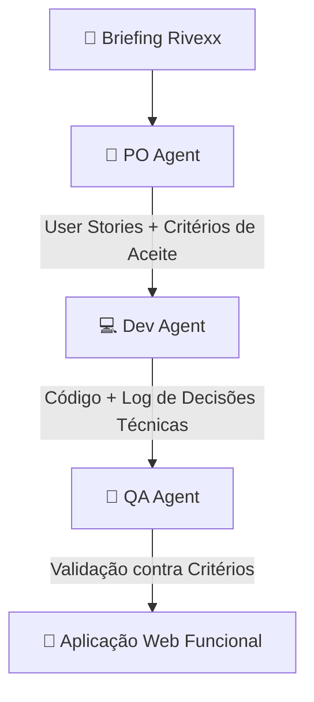

# Hackathon Reply 2026 - Trilha B
Desafio consiste em construir uma solução ou agente inteligente que automatize e acelere etapas do ciclo de vida de desenvolvimento de software (SDLC). O foco sai do monitoramento de infraestrutura em produção e vai para a produtividade da engenharia de software durante a escrita e manutenção de código.


## 📌 Sobre o Projeto

A **Rivexx Componentes** é uma indústria de componentes plásticos de alta precisão que supre os setores automotivo e eletroeletrônico em 2 plantas com operação em 3 turnos (480 colaboradores). 

Este projeto entrega um **Squad Autônomo de Agentes de IA** (PO Agent, Dev Agent e QA Agent) que recebe o briefing do problema da Rivexx, orquestra tarefas entre si de forma visível e auditável, e entrega uma aplicação web funcional local para centralização e rastreabilidade da qualidade.

### 📊 Apresentação & Pitch Deck
- 📢 **Pitch Deck em Slides (PPT Interactive):** [Acessar Apresentação do Pitch](https://docs.google.com/presentation/d/1cEV_et7xpIk_lS8jQb_aWymGlyeqLzAx/edit?usp=sharing&ouid=115014557577006516562&rtpof=true&sd=true)
- 📄 **Pitch Deck em PDF Exportável:** [Baixar Pitch Deck PDF](pitch_deck_rivexx.pdf)

---

## 🎯 Dores do Cliente & Solução Entregue

| Problema na Rivexx | Solução do Squad de IA | Indicador de Impacto (KPI) |
| :--- | :--- | :---: |
| **Investigação Manual Lenta:** Reconstituir histórico leva horas com papéis e planilhas pulverizadas. | **Registro Ágil Responsivo:** Formulário focado no chão de fábrica operável pelo celular sem treinamento. | **-65% MTTR** |
| **Causa Raiz Baseada em "Opinião":** Análise subjetiva sem acompanhamento de ações corretivas. | **Causa Raiz Assistida:** Sugestão inteligente (Ishikawa / 5 Porquês) + Plano de Ação automático. | **-80% Reincidência** |
| **Respostas Lentas ao Cliente:** Impossibilidade de conter lotes afetados com rapidez. | **Rastreabilidade de Lote em Segundos:** Mapeamento visual: Insumo ➔ Equipamento ➔ Turno ➔ Expedição. | **< 10s Rastreio** |
| **Risco em Auditorias Trimestrais:** Falta de evidências auditáveis de turno e operador. | **Auditabilidade Total:** Registro imutável de data, responsável, turno e equipamento. | **100% Compliance** |

---

## 🤖 Arquitetura do Squad Autônomo

O squad atua em fluxo em cadeia (*pipeline* autônomo e auditável):



Um squad de três agentes autônomos (**PO**, **Dev** e **QA**) recebe um briefing em texto bruto, interpreta o domínio de negócio, planeja a arquitetura da aplicação, escreve o código das telas e valida a qualidade de cada entregável antes da liberação.

As páginas web geradas **não existem previamente no projeto** — elas são concebidas, desenvolvidas e testadas do zero a cada execução.

```text
                  ┌─────────────────┐
                  │ Briefing Bruto  │
                  └────────┬────────┘
                           │
                           ▼
                  ┌─────────────────┐
                  │    PO Agent     │  ──► Domínio, telas e critérios de aceite
                  └────────┬────────┘
                           │
                           ▼
                  ┌─────────────────┐
                  │    Dev Agent    │  ──► Decisões técnicas e geração do HTML/CSS/JS
                  └────────┬────────┘
                           │
                           ▼
                  ┌─────────────────┐
                  │    QA Agent     │  ──► Gate de 12 asserções Python + Revisão LLM
                  └────────┬────────┘
                           │
             ┌─────────────┴─────────────┐
             ▼                           ▼
        [ APROVADO ]                [ REPROVADO ]
             │                           │
             ▼                           └─► Retorna ao Dev (até 2x)
   Próxima tela / Finalização
```

---

## 🛠️ Arquitetura & Como Funciona

A plataforma atua como um runtime e compilador para os agentes. O ecossistema é dividido em duas camadas bem definidas:

### 1. Plataforma (Infraestrutura Fixa)
* **Orquestração com LangGraph:** O fluxo de execução do squad é estruturado como um grafo determinístico com loops de refatoração.
* **Gate Automático em Python (`app/squad/gate.py`):** Antes da avaliação do agente de QA, o código HTML gerado passa por 12 verificações estáticas rigorosas (tags balanceadas, viewport, componentes CSS/JS, integração com API e ausência de recursos externos não autorizados).
* **API Schemaless de Storage:** Um backend genérico em FastAPI que disponibiliza endpoints para persistência em JSON (`/api/apps/{projeto}/records`), permitindo que qualquer aplicação gerada grave e recupere dados sem necessidade de migrations prévias.
* **Audit Trail e Workbench:** Banco SQLite (`db.py`) e barramento de eventos (`bus.py`) que registram todas as interações e decisões em tempo real na interface `/squad`.

### 2. Agentes (Conteúdo Dinâmico)
* **PO Agent:** Analisa o briefing, extrai regras de negócio, define a taxonomia do sistema, lista as telas necessárias e estipula os critérios de aceite.
* **Dev Agent:** Constrói arquivos HTML autocontidos (`gerados/{projeto}/*.html`), incorporando lógica de interface, estilos e chamadas de persistência via API.
* **QA Agent:** Executa os testes de validação, analisa o código-fonte gerado e fornece pareceres técnicos detalhados com sugestões ou bloqueios.

---

## 🚀 Como Executar

### Pré-requisitos
* Python 3.10+
* Chave de API da Anthropic (`ANTHROPIC_API_KEY`)

### Passo a Passo

```bash
# 1. Clone o repositório
git clone https://github.com/seu-usuario/squad-forge.git
cd squad-forge

# 2. Crie e ative o ambiente virtual
python -m venv venv
# Linux/macOS:
source venv/bin/activate
# Windows (PowerShell):
. env\Scripts\Activate.ps1

# 3. Instale as dependências
pip install -r requirements.txt

# 4. Configure as variáveis de ambiente
cp .env.example .env
# Adicione sua ANTHROPIC_API_KEY no arquivo .env

# 5. Inicie o servidor
uvicorn app.main:app --reload
```

Acesse o console em **`http://localhost:8000`** e navegue até **Novo briefing**.

---

## 🧪 Modo Offline / Mock

Para testar o fluxo completo do grafo sem utilizar saldo ou conexão com a API da Anthropic:

```bash
# Linux/macOS
export SQUAD_MODE=mock

# Windows (PowerShell)
$env:SQUAD_MODE="mock"

# Executar o servidor
uvicorn app.main:app --reload
```

---

## 📁 Estrutura do Projeto

```text
app/
├── main.py            # Servidor FastAPI, rotas do workbench e hospedagem das apps
├── db.py              # Banco SQLite (audit trail, projetos e storage schemaless)
├── llm.py             # Abstração de chamadas à API da Anthropic
└── squad/
    ├── prompts.py     # Contratos, handoffs e personas dos agentes
    ├── graph.py       # Grafo de orquestração LangGraph
    ├── gate.py        # Gate com as 12 verificações automáticas sobre o HTML
    ├── bus.py         # Barramento para trilha de auditoria
    └── mock.py        # Execução simulada offline
gerados/               # Aplicações geradas por projeto (*.html e artefatos)
```

---

## ⚙️ Variáveis de Ambiente

| Variável | Padrão | Descrição |
|---|---|---|
| `ANTHROPIC_API_KEY` | — | Chave de API da Anthropic |
| `SQUAD_MODE` | `live` | Define se o executor roda em modo real (`live`) ou simulado (`mock`) |
| `ANTHROPIC_MODEL` | `claude-sonnet-5` | Modelo LLM utilizado pelos três agentes |
| `SQUAD_MAX_TOKENS` | `8000` | Teto de tokens para chamadas de planejamento em JSON |
| `SQUAD_MAX_TOKENS_CODIGO` | `16000` | Teto de tokens para geração de código HTML/JS/CSS |

---

## 🤝 Artefatos Entregues

A cada ciclo de execução finalizado, o squad produz automaticamente na pasta `gerados/{projeto}/`:
1. As páginas funcionais do sistema (`*.html`).
2. O backlog detalhado do produto em Markdown.
3. O registro de decisões técnicas e de design.
4. O relatório completo de auditoria do QA com a avaliação do gate de 12 asserções.
