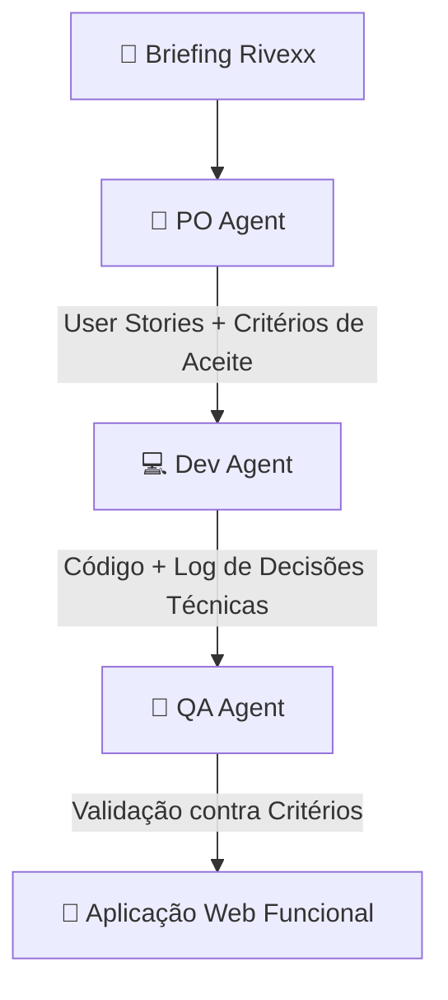

# Hackathon Reply 2026 - Trilha B
Desafio consiste em construir uma solução ou agente inteligente que automatize e acelere etapas do ciclo de vida de desenvolvimento de software (SDLC). O foco sai do monitoramento de infraestrutura em produção e vai para a produtividade da engenharia de software durante a escrita e manutenção de código.

## 📌 Sobre o Projeto

A **Rivexx Componentes** é uma indústria de componentes plásticos de alta precisão que supre os setores automotivo e eletroeletrônico em 2 plantas com operação em 3 turnos (480 colaboradores). 

Este projeto entrega um **Squad Autônomo de Agentes de IA** (PO Agent, Dev Agent e QA Agent) que recebe o briefing do problema da Rivexx, orquestra tarefas entre si de forma visível e auditável, e entrega uma aplicação web funcional local para centralização e rastreabilidade da qualidade.

### 📊 Apresentação & Pitch Deck
- 📢 **Pitch Deck em Slides (PPT Interactive):** [Acessar Apresentação do Pitch](https://docs.google.com/presentation/d/1cEV_et7xpIk_lS8jQb_aWymGlyeqLzAx/edit?usp=sharing&ouid=115014557577006516562&rtpof=true&sd=true)
- 📄 **Pitch Deck em PDF Exportável:** [Baixar Pitch Deck PDF](pitch_deck_rivexx.pdf)

---

## 🎯 Dores do Cliente & Solução Entregue

| Problema na Rivexx | Solução do Squad de IA | Indicador de Impacto (KPI) |
| :--- | :--- | :---: |
| **Investigação Manual Lenta:** Reconstituir histórico leva horas com papéis e planilhas pulverizadas. | **Registro Ágil Responsivo:** Formulário focado no chão de fábrica operável pelo celular sem treinamento. | **-65% MTTR** |
| **Causa Raiz Baseada em "Opinião":** Análise subjetiva sem acompanhamento de ações corretivas. | **Causa Raiz Assistida:** Sugestão inteligente (Ishikawa / 5 Porquês) + Plano de Ação automático. | **-80% Reincidência** |
| **Respostas Lentas ao Cliente:** Impossibilidade de conter lotes afetados com rapidez. | **Rastreabilidade de Lote em Segundos:** Mapeamento visual: Insumo ➔ Equipamento ➔ Turno ➔ Expedição. | **< 10s Rastreio** |
| **Risco em Auditorias Trimestrais:** Falta de evidências auditáveis de turno e operador. | **Auditabilidade Total:** Registro imutável de data, responsável, turno e equipamento. | **100% Compliance** |

---

## 🤖 Arquitetura do Squad Autônomo

O squad atua em fluxo em cadeia (*pipeline* autônomo e auditável):

1. **PO Agent (Product Owner):** Recebe o briefing, interpreta os requisitos do cliente e constrói o backlog com User Stories e critérios de aceite em formato *Given-When-Then*.
2. **Dev Agent (Developer & Architect):** Consome o backlog, toma decisões de arquitetura técnica, desenvolve a aplicação responsiva e registra as justificativas técnicas no log.
3. **QA Agent (Quality Assurance):** Intercepta o código gerado pelo Dev, cria e executa suítes de teste contra os critérios do PO e emite o relatório de liberação.

---

## 🛠️ Entregáveis do Hackathon

Os artefatos gerados automaticamente pela execução do squad são:

- `app.py`: Aplicação Web completa cobrindo os 3 cenários operacionais.
- `backlog_po.md`: User Stories priorizadas geradas pelo **PO Agent**.
- `log_decisoes_dev.md`: Registro de decisões técnicas de arquitetura gerado pelo **Dev Agent**.
- `relatorio_qa.md`: Matriz de testes executados e evidências gerada pelo **QA Agent**.
- `pitch_deck_rivexx.ppt` / `pitch_deck_rivexx.pdf`: Apresentação executiva em formato.
